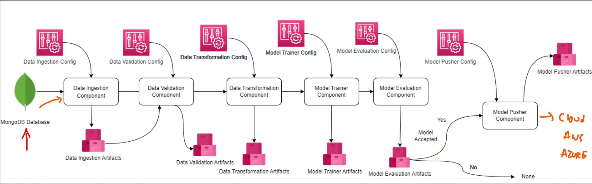

# MLOPS-Network-Security


[](https://github.com/darshanp2005/MLOPS-Network_Security/actions)
[](https://example.com/coverage-report)

## Project Overview

Comprehensive MLOps pipeline designed for real-time network security threat detection. This project leverages machine learning to classify network traffic into 'normal' or 'anomalous/malicious' categories, providing a proactive approach to cybersecurity. By implementing a full end-to-end CI/CD pipeline with GitHub Actions, the system ensures continuous integration, delivery, and deployment on a robust AWS infrastructure.

### Flow
### Flow

<p align="center">
  
</p>

### The Business Problem

In an era of increasing cyber threats, organizations face the challenge of rapidly detecting and responding to malicious network activities. Traditional security systems often rely on signature-based detection, which is ineffective against new and evolving threats (zero-day attacks). This project addresses the need for an intelligent, adaptive security solution that can identify suspicious patterns in real-time.

### Impact and Use Cases

- **Enterprise Security**: Enhances the security posture of organizations by providing an additional layer of intelligent threat detection.
- **Cloud Infrastructure Protection**: Secures cloud environments by monitoring network traffic for suspicious activities.
- **Financial Services**: Protects sensitive financial data by identifying and flagging potentially fraudulent network behavior.

### Key Features

- **End-to-End MLOps Pipeline**: From data ingestion to model deployment and monitoring.
- **Automated CI/CD**: Using GitHub Actions for seamless integration and deployment.
- **Scalable AWS Infrastructure**: Deployed on AWS EC2 with container orchestration managed by Docker.
- **Real-time Prediction API**: A Flask-based API for on-demand network traffic classification.
- **Centralized Data Storage**: Utilizes MongoDB for storing training data, model artifacts, and prediction logs.
- **Containerized Application**: Dockerized for portability and consistent deployments.

## 🛠️ Technology Stack

| Category                  | Technology                                                              |
| ------------------------- | ----------------------------------------------------------------------- |
| **Programming Languages** | `Python`                                                                |
| **ML Frameworks**         | `Scikit-learn`, `Pandas`, `NumPy`                                       |
| **Containerization**      | `Docker`                                                                |
| **Cloud Services (AWS)**  | `EC2`, `ECR`, `S3` (for data storage), `IAM`                            |
| **CI/CD Tools**           | `GitHub Actions`                                                        |
| **Database**              | `MongoDB`                                                               |
| **Monitoring & Logging**  | `CloudWatch` (via AWS CLI), `Custom Logging`                            |
| **Testing**               | `pytest`                                                                |

## Prerequisites

### System Requirements

- Python 3.8 or higher
- Docker
- AWS CLI

### AWS Account Setup

- An active AWS account.
- An IAM user with programmatic access and the following permissions:
  - `AmazonEC2FullAccess`
  - `AmazonECRFullAccess`
  - `IAMFullAccess` (for creating roles)
- Configure your AWS CLI with the credentials of this IAM user.

### Local Development Tools

- Git
- A code editor like VS Code.

### Environment Variables

You will need to create a `.env` file in the root of the project with the following variables:

```bash
MONGO_DB_URL="<your_mongodb_url>"
```

## Project Structure

```
.
├── .github/workflows/
│   └── main.yml         # GitHub Actions CI/CD pipeline
├── networksecurity/
│   ├── components/      # Core components for the ML pipeline
│   ├── pipeline/        # ML pipeline scripts (training, prediction)
│   ├── entity/          # Entity definitions
│   ├── constants/       # Project constants
│   └── ...              # Other modules
├── templates/
│   └── index.html       # Simple frontend for API interaction
├── app.py               # Main Flask application
├── Dockerfile           # Docker configuration for the application
├── requirements.txt     # Python dependencies
├── setup.py             # Project setup script
└── README.md            # This file
```

-   **`.github/workflows/main.yml`**: Defines the CI/CD pipeline using GitHub Actions.
-   **`networksecurity/`**: The core Python package for the project.
-   **`app.py`**: The entry point for the Flask prediction API.
-   **`Dockerfile`**: Instructions to build the Docker image for the application.
-   **`requirements.txt`**: A list of all Python packages required for the project.
-   **`setup.py`**: Makes the `networksecurity` directory an installable package.

## Setup & Installation

### Quick Start

For a quick setup, follow these steps:

1.  **Clone the repository:**
    ```bash
    git clone https://github.com/darshanp2005/MLOPS-Network_Security.git
    cd MLOPS-Network-Security
    ```

2.  **Create a virtual environment:**
    ```bash
    python3 -m venv venv
    source venv/bin/activate
    ```

3.  **Install dependencies:**
    ```bash
    pip install -r requirements.txt
    ```

4.  **Set up environment variables:**
    Create a `.env` file and add your MongoDB connection string.
    ```bash
    echo "MONGO_DB_URL=<your_mongodb_url>" > .env
    ```

5.  **Run the application:**
    ```bash
    python app.py
    ```

## 🐳 Docker Containerization

### Build the Docker Image

To build the Docker image locally, run:

```bash
docker build -t network-sentinel .
```

### Multi-Stage Build

The `Dockerfile` uses a multi-stage build to create a lean final image.
- The `builder` stage installs dependencies.
- The final stage copies only the necessary application code and dependencies.

### Running the Container Locally

To run the containerized application on your local machine:

```bash
docker run -p 8080:8080 --env-file .env network-sentinel
```

The application will be accessible at `http://localhost:8080`.

## ☁️ AWS Deployment Configuration

### ECR Repository Setup

1.  **Create an ECR repository:**
    ```bash
    aws ecr create-repository --repository-name network-sentinel --region <your-aws-region>
    ```

### EC2 Instance Configuration

-   **Instance Type**: `t2.micro` or `t2.small` (depending on the expected load).
-   **AMI**: Amazon Linux 2 or Ubuntu Server.
-   **Security Groups**:
    -   Allow inbound traffic on port `22` (SSH) from your IP.
    -   Allow inbound traffic on port `8080` (application) from anywhere (`0.0.0.0/0`).
-   **IAM Role**: Attach an IAM role to the EC2 instance with `AmazonEC2ContainerRegistryReadOnly` policy to allow pulling images from ECR.

### GitHub Actions Self-Hosted Runner Setup

1.  **SSH into your EC2 instance.**
2.  Follow the official GitHub documentation to [add a self-hosted runner](https://docs.github.com/en/actions/hosting-your-own-runners/adding-self-hosted-runners).
3.  Install Docker on the EC2 instance.

### AWS CLI Configuration

Ensure the AWS CLI is configured on your local machine and on the EC2 instance (if needed for any scripts).

```bash
aws configure
```

## CI/CD Pipeline Details

The CI/CD pipeline is defined in `.github/workflows/main.yml` and consists of three main jobs.

### Continuous Integration (`Integration`)

-   **Trigger**: On every push to the `main` branch.
-   **Steps**:
    1.  Checks out the code.
    2.  Sets up Python.
    3.  Installs dependencies.
    4.  Runs `pylint` for static code analysis.
    5.  Runs `pytest` for unit tests.

### Build & Push (`Build-and-Push-Image-to-ECR`)

-   **Trigger**: Runs after the `Integration` job succeeds.
-   **Steps**:
    1.  Logs into AWS ECR.
    2.  Builds the Docker image.
    3.  Tags and pushes the image to the ECR repository.

### Continuous Deployment (`Deploy-to-EC2`)

-   **Trigger**: Runs after the `Build-and-Push-Image-to-ECR` job succeeds.
-   **Runner**: Uses the `self-hosted` runner on the EC2 instance.
-   **Steps**:
    1.  Pulls the latest image from ECR.
    2.  Stops and removes the old container.
    3.  Starts a new container with the new image.

### Secrets Management

The pipeline uses GitHub Secrets to securely store AWS credentials and other sensitive information.

## Environment Variables & Secrets

### GitHub Secrets

| Secret                | Description                            |
| --------------------- | -------------------------------------- |
| `AWS_ACCESS_KEY_ID`   | AWS access key for the IAM user.       |
| `AWS_SECRET_ACCESS_KEY` | AWS secret key for the IAM user.       |
| `AWS_REGION`          | The AWS region for deployment.         |
| `ECR_REPOSITORY`      | The name of the ECR repository.        |
| `MONGO_DB_URL`        | MongoDB connection string.             |

### Container Environment Variables

| Variable       | Description               |
| -------------- | ------------------------- |
| `MONGO_DB_URL` | MongoDB connection string. |
| `PORT`         | Port for the Flask app.   |

## Model Training & Evaluation

### Dataset

The model is trained on the `phisingData.csv` dataset, which contains various features of network traffic.

### Feature Engineering

-   **Numerical Scaling**: Standard scaling is applied to numerical features.
-   **Categorical Encoding**: One-hot encoding is used for categorical features.

### ML Algorithms

The project uses a `RandomForestClassifier` from Scikit-learn for classification.

### Training Scripts

The training pipeline is orchestrated by scripts in the `networksecurity/pipeline/` directory. To run the training pipeline:

```bash
python -m networksecurity.pipeline.training_pipeline
```

### Model Evaluation

The model is evaluated using the following metrics:
-   Accuracy
-   Precision
-   Recall
-   F1-Score

## API Endpoints

The application provides a single endpoint for predictions.

### `POST /predict`

-   **Description**: Classifies a given network traffic sample.
-   **Request Body**:
    ```json
    {
      "feature1": "value1",
      "feature2": "value2",
      ...
    }
    ```
-   **Response**:
    ```json
    {
      "prediction": "normal"
    }
    ```

## Monitoring & Logging

-   **Application Logs**: Logs are printed to the container's standard output. You can view them using `docker logs <container_id>`.
-   **Health Checks**: The application has a `/` endpoint that returns a `200 OK` status for health checks.
-   **AWS CloudWatch**: For a production setup, logs can be streamed to CloudWatch using the AWS CloudWatch Logs agent.

## Testing

### Unit Tests

To run unit tests:

```bash
pytest
```

### Test Coverage

Coverage reports can be generated using `pytest-cov`.

```bash
pytest --cov=networksecurity
```

## Troubleshooting Guide

-   **Docker container exits immediately**: Check the container logs (`docker logs <container_id>`) for errors.
-   **Port 8080 not accessible**: Ensure the security group on your EC2 instance allows inbound traffic on port 8080.
-   **MongoDB connection failures**: Verify your `MONGO_DB_URL` and ensure the database is accessible from your application's host.

## Security Best Practices

-   **IAM Roles**: Use IAM roles with the principle of least privilege.
-   **Secrets Management**: Store all secrets in GitHub Secrets, not in the code.
-   **Container Security**: Regularly scan your Docker images for vulnerabilities.

